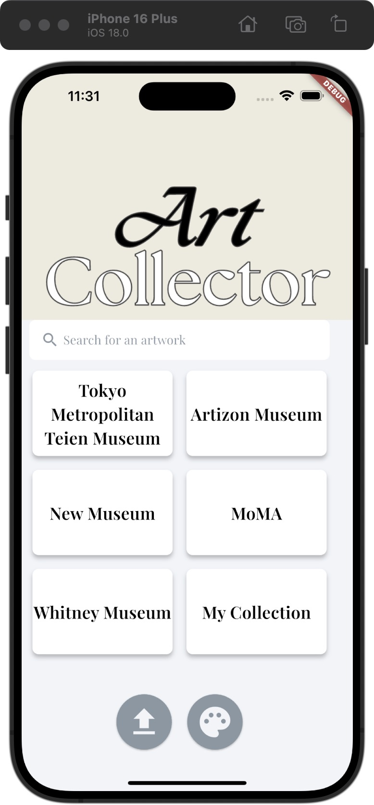
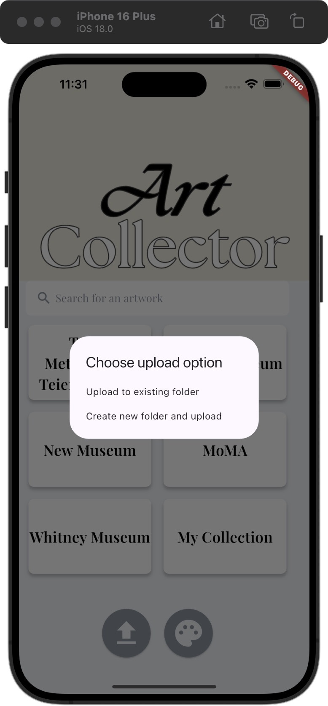
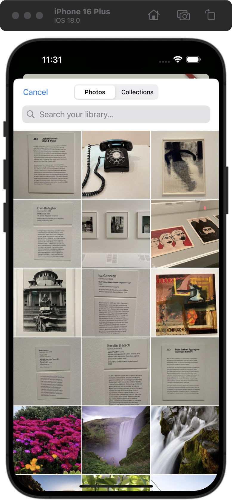
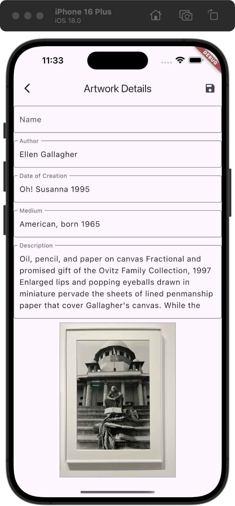
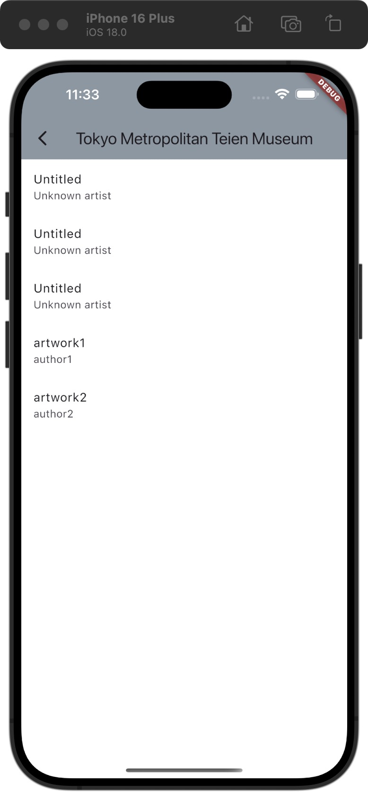
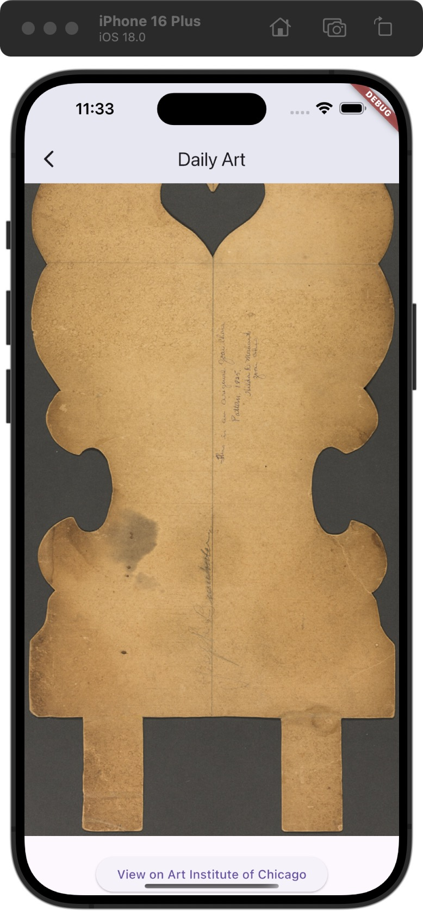

# 🍸 ArtCollector

1. front-end

```
open -a Simulator
flutter clean
flutter pub get
flutter run
```

progress: 

(2024.8.15) added the artwork detail page that fetches the artwork data from the backend and upload user edited text to the backend

(2024.8.8) added the result page (for testing purpose) to show the extracted json result

(2024.8.7) upload selected image to Azure Storage Account

(2024.8.2) home page with upload button & access to photo gallery (image picker)

(2024.7.20) login page (unstyled)

2. back-end

```python3 manage.py runserver```

progress:

(2024.9) Implemented folder-artworks many-to-one relational database. Implemented random generation of artworks fetched from the Art Institute of Chicago API. Adjusted front-end presentation accordingly.

(2024.8.15) Integrated the backend with Azure Storage Account and Azure Document Intelligence (OCR service).

~~(2024.8.8) Added the flask api to retrieve processed results and load them to a url.~~

(2024.8.4) Built Azure AI client, customized Azure Document Intelligence ready-to-go.

(2024.7.20) Minimum django db (artwork & folder models, admin site).


#  📋 TO-DO (Updated on Sep 21)
- User model, user auth, etc.
- Fix features.
- Faster rendering.

# 🍢 UI images






